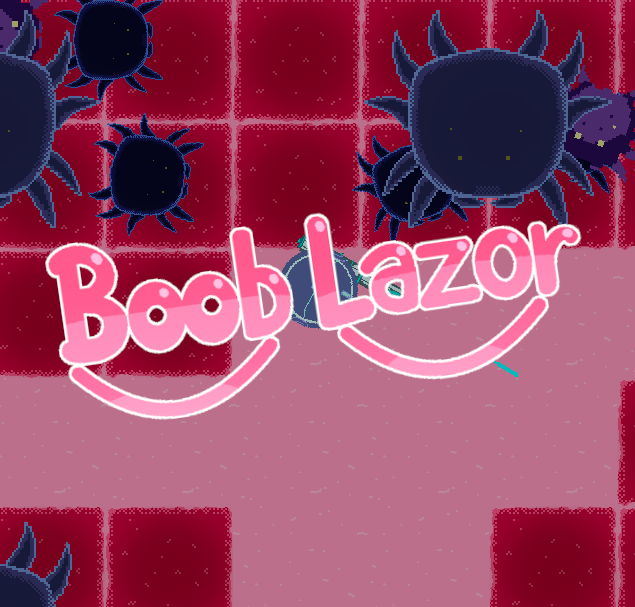

  

<h3 align="center">Booblazor</h3>

## 📝 Table of Contents

* [About](#about)
* [Credits](#credits)
* [Instructions](#instructions)

## 🧐 About 

BoobLazor was created for the 42 hour 2020 boob jam meant to support the prevention of breast cancer. You play as a robot injected into the breast of a patient with the goal of destroying the cancer cells using a lazer gun before they replicate and manifest it. The game was further developped completed after the initial 42 hours since we wanted to create the game in Love2D, with which we had no prior experience and we were learning on the go.

## ❤️ Credits 

In the following links, you can learn more about prevention of breast cancer and how to give support:
* [https://www.breastcancer.org/](https://www.breastcancer.org/)
* [https://www.nhs.uk/conditions/breast-cancer/](https://www.nhs.uk/conditions/breast-cancer/)
* [https://oma.syopasaatio.fi/roosa-nauha/5-14165?fbclid=IwAR08XxnLQe51Bya-hWEptL5HykmcM-JdCumA84V7P6vMsoInHvoY5pKTNew](https://oma.syopasaatio.fi/roosa-nauha/5-14165?fbclid=IwAR08XxnLQe51Bya-hWEptL5HykmcM-JdCumA84V7P6vMsoInHvoY5pKTNew)
* [https://www.bcrf.org/](https://www.bcrf.org/)

## 🕹️ Instructions 

You can skip dialogue using the space button. To fire use the primary mouse button and to move you can use the WSAD keys.
